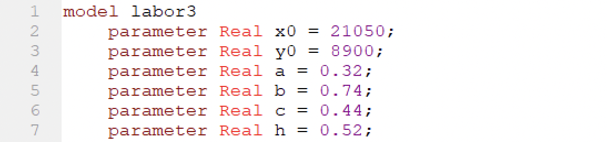
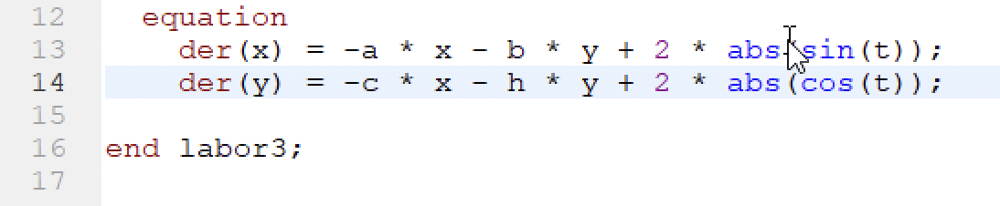
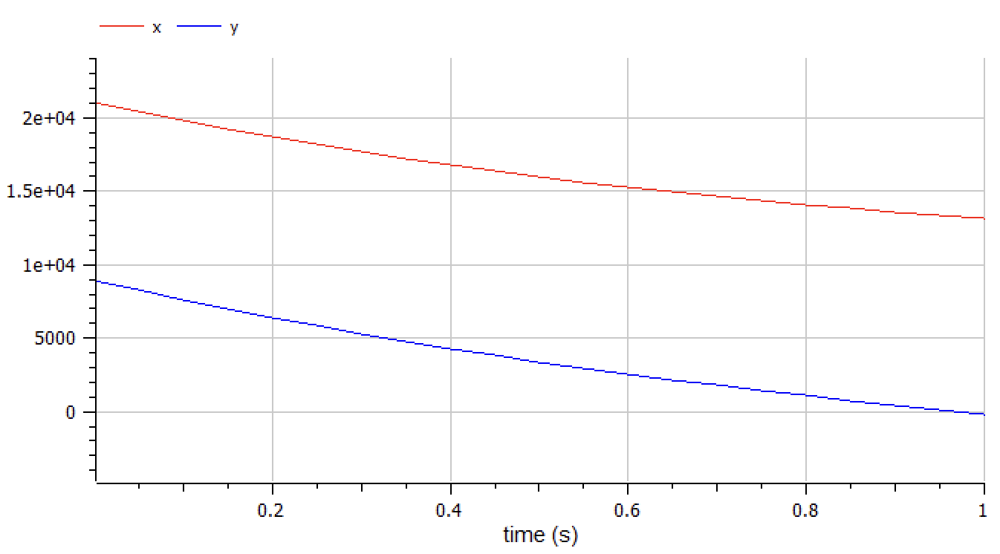
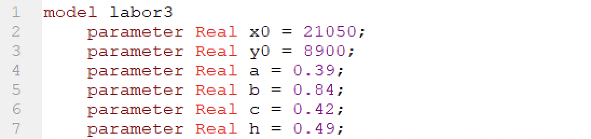
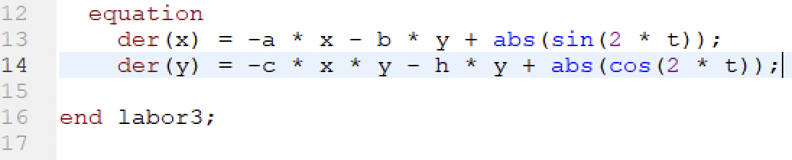
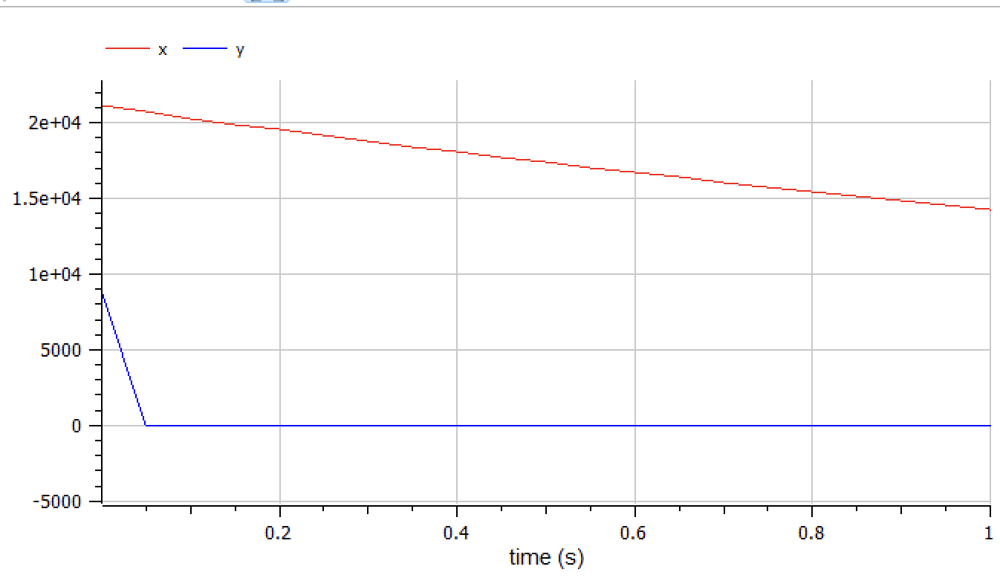

---
# Front matter
title: "Отчёт по лабораторной работе №3"  
subtitle: "Вариант 39"  
author: "Александр Олегович Воробьев"

# Generic otions
lang: ru-RU
toc-title: "Содержание"

# Bibliography
bibliography: bib/cite.bib
csl: pandoc/csl/gost-r-7-0-5-2008-numeric.csl

# Pdf output format
toc: true # Table of contents
toc_depth: 2
lof: true # List of figures
lot: true # List of tables
fontsize: 12pt
linestretch: 1.5
papersize: a4
documentclass: scrreprt
## I18n
polyglossia-lang:
  name: russian
  options:
	- spelling=modern
	- babelshorthands=true
polyglossia-otherlangs:
  name: english
### Fonts
mainfont: PT Serif
romanfont: PT Serif
sansfont: PT Sans
monofont: PT Mono
mainfontoptions: Ligatures=TeX
romanfontoptions: Ligatures=TeX
sansfontoptions: Ligatures=TeX,Scale=MatchLowercase
monofontoptions: Scale=MatchLowercase,Scale=0.9
## Biblatex
biblatex: true
biblio-style: "gost-numeric"
biblatexoptions:
  - parentracker=true
  - backend=biber
  - hyperref=auto
  - language=auto
  - autolang=other*
  - citestyle=gost-numeric
## Misc options
indent: true
header-includes:
  - \linepenalty=10 # the penalty added to the badness of each line within a paragraph (no associated penalty node) Increasing the value makes tex try to have fewer lines in the paragraph.
  - \interlinepenalty=0 # value of the penalty (node) added after each line of a paragraph.
  - \hyphenpenalty=50 # the penalty for line breaking at an automatically inserted hyphen
  - \exhyphenpenalty=50 # the penalty for line breaking at an explicit hyphen
  - \binoppenalty=700 # the penalty for breaking a line at a binary operator
  - \relpenalty=500 # the penalty for breaking a line at a relation
  - \clubpenalty=150 # extra penalty for breaking after first line of a paragraph
  - \widowpenalty=150 # extra penalty for breaking before last line of a paragraph
  - \displaywidowpenalty=50 # extra penalty for breaking before last line before a display math
  - \brokenpenalty=100 # extra penalty for page breaking after a hyphenated line
  - \predisplaypenalty=10000 # penalty for breaking before a display
  - \postdisplaypenalty=0 # penalty for breaking after a display
  - \floatingpenalty = 20000 # penalty for splitting an insertion (can only be split footnote in standard LaTeX)
  - \raggedbottom # or \flushbottom
  - \usepackage{float} # keep figures where there are in the text
  - \floatplacement{figure}{H} # keep figures where there are in the text
---

# Цель работы

Изучить модели боевых действий - модели Ланчестера и построить их для двух случаев: боевые действия между регулярными войсками и боевые действия с участием регулярных войск и партизанских отрядов. 

# Задание

Между страной Х и страной У идет война. Численность состава войск исчисляется от начала войны, и являются временными функциями x(t) и y(t). В
начальный момент времени страна Х имеет армию численностью 21 050 человек, а в распоряжении страны У армия численностью в 8 900 человек. Для упрощения модели считаем, что коэффициенты a,b,c,h постоянны. Также считаем P(t) и
Q(t) непрерывные функции.
Постройте графики изменения численности войск армии Х и армии У для следующих случаев:
	
	1. Модель боевых действий между регулярными войсками:  

	dx/dt = -0.32x(t) - 0.74y(t) + 2|sin(t)|  
	dy/dt = -0.44x(t) - 0.52y(t) + 2|cos(t)|  

	2. Модель ведение боевых действий с участием регулярных войск и партизанских отрядов:  
	
	dx/dt = -0.39x(t) - 0.84y(t) + |sin(2t)|  
	dx/dt = -0.42x(t) - 0.49y(t) + |cos(2t)|  

	
# Теоретическое введение

В первом случае модель боевых действий между регулярными войсками описывается следующим образом:  
	dx/dt = -a(t)x(t) - b(t)y(t) + P(t)  
	dx/dt = -c(t)x(t) - h(t)y(t) + Q(t)  

Потери, не связанные с боевыми действиями, описывают члены -a(t)x(t) и -h(t)y(t), члены -b(t)y(t) и -c(t)x(t) отражают потери на поле боя.  
Коэффициенты b(t) и c(t) указывают на эффективность боевых действий со стороны у и х соответственно, a(t), h(t) - величины, характеризующие степень влияния различных факторов на потери. Функции P(t),Q(t) учитывают
возможность подхода подкрепления к войскам Х и У в течение одного дня.  

Во втором случае в борьбу добавляются партизанские отряды. Нерегулярные войска в отличии от постоянной армии менее уязвимы, так как действуют скрытно, в этом случае сопернику приходится действовать неизбирательно, по площадям, занимаемым партизанами. Поэтому считается, что тем потерь партизан, проводящих свои операции в разных местах на некоторой известной территории, пропорционален не только численности армейских соединений, но и численности
самих партизан. В результате модель принимает вид:  
	dx/dt = -a(t)x(t) - b(t)y(t) + P(t)  
	dx/dt = -c(t)x(t)y(t) - h(t)y(t) + Q(t)  

# Выполнение лабораторной работы

**1. Пропишем программу для отображения модели первого случая: боевые действия между регулярными войсками.** 

	Задаём исходные значения в соответствующие переменные:
{ #fig:001 width=70% }  

	Объявляем переменную для времени t и присваиваем переменным x и y начальные значения:  
{ #fig:002 width=70% }  

	Пропишем систему дифференциальных уравнений:  
{ #fig:003 width=70% } 

	Запускаем модель для времени 0 < t < 1 с интервалом 0,05:  
{ #fig:004 width=70% } 

**2. Изменим программу для второго случая: боевые действия с участием регулярных войск и партизанских отрядов.**  

	Зададим новые значения для переменных a, b, c, h:  
{ #fig:005 width=70% }  

	Переменные t, x, y сохраняют свои значения:  
{ #fig:006 width=70% }  

	Пропишем систему дифференциальных уравнений для второго случая:  
{ #fig:007 width=70% }  

	Запускаем модель второго случая для времени 0 < t < 1 с интервалом 0,05:  
{ #fig:008 width=70% }  

# Выводы

В ходе выполнения лабораторной работы я познакомился с моделями Ланчестера для боевых действий и реализовал модели для двух случаев: боевых действий между регулярными войсками и боевых действий с участием регулярных войск и партизанских отрядов.  

# Список литературы{.unnumbered}

	1. Кулябов Д.С. Лабораторная работа №3. Модель боевых действий [Электронный ресурс] - 7 с. 
	2. Кулябов Д.С. Лабораторная работа №3. Варианты [Электронный ресурс] - 47 с. 

::: {#refs}
:::
